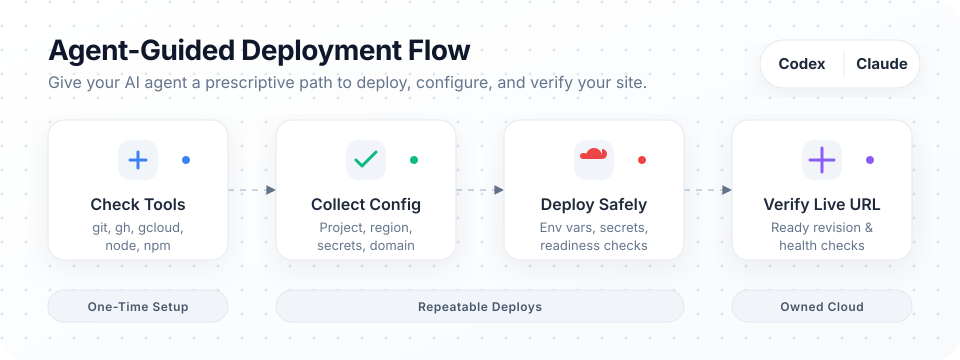
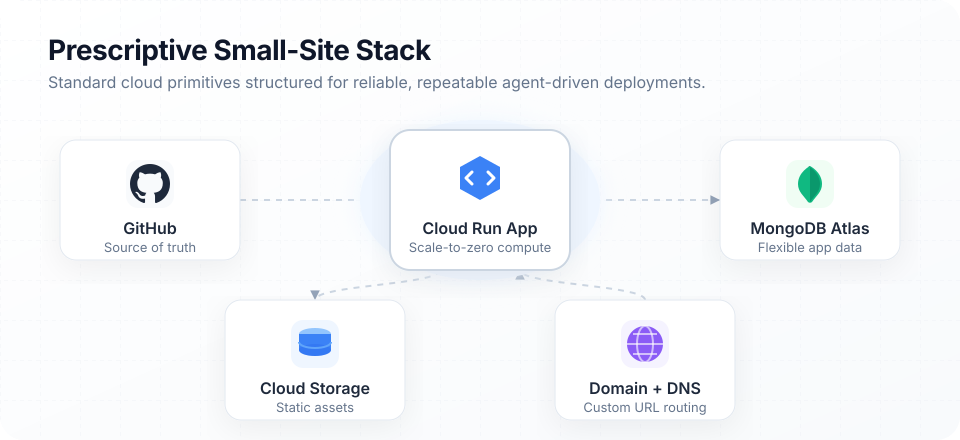
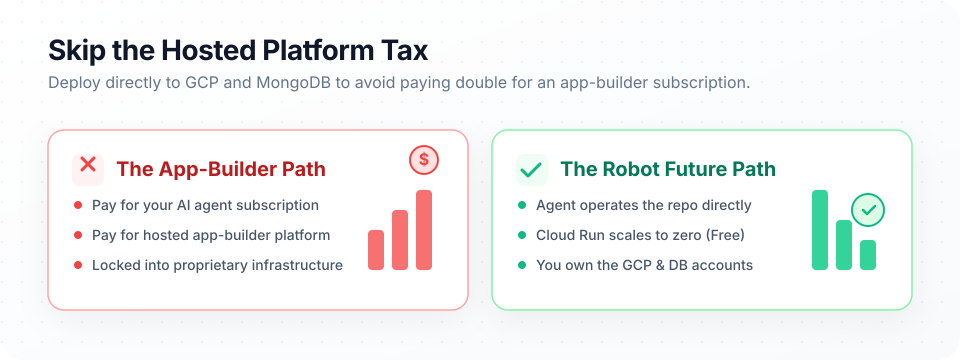

# 🤖 Robot Stack - by Robot Future

[](./SKILL.md)
[](#claude-code-usage)
[](#cursor-usage)
[](#stack-shape)

A reusable Codex skill and Claude Code companion pack for shipping small websites without learning every cloud product the hard way.



**While the initial setup is optimized for small, low-traffic sites, it runs on enterprise-grade infrastructure (Google Cloud and MongoDB) that can seamlessly scale up to support any size website, serving millions of users as your project grows.**

If you already pay for an AI coding agent like Codex, Claude Code, or Cursor, you should be able to use that agent to build, configure, deploy, and update a real site—without also paying for a hosted app builder (such as Replit or Lovable) just to get it online. 

This skill gives your agent a **prescriptive deployment path**:
- **GitHub** for the repository
- **MongoDB Atlas** (or your existing DB) for flexible app data
- **Google Cloud Run** for low-cost, scale-to-zero hosting
- **Google Cloud Storage** for assets
- **Squarespace / Custom DNS** for domain setup

The goal is to make cloud deployment feel routine for everyday agent users. Cloud Run can scale idle hobby sites down to zero, MongoDB works well while product data is still changing shape, and the included scripts encode the repeated setup steps so later deploys are boring. The defaults are opinionated because agents work better with a clear target, but the workflow can adapt to existing projects instead of demanding a rewrite.

## ✨ What It Does

- **Validates Environment:** Checks whether `git`, `gh`, `gcloud`, `node`, and `npm` are installed.
- **Guided Onboarding:** Walks the user through one-time account and CLI setup.
- **Minimal Interruptions:** Pauses only when human input is actually needed, such as browser auth or secret entry.
- **Stateful Config:** Stores reusable local stack settings (`~/.robot-stack/`) for later deploys.
- **Cost-Optimized Defaults:** Encodes cheap Cloud Run defaults for low-traffic sites (scale-to-zero, low CPU/memory).
- **Containerization:** Includes the Robot Future Dockerfile as a known-good example and explains when to adapt it.
- **Safe Deployments:** Reconciles Cloud Run env vars, Secret Manager bindings, readiness, and live health checks during deploy.
- **Repeatable Workflow:** Provides a robust deploy helper script so later updates are entirely routine.

## 🏗️ Stack Shape



## 💸 Why It Saves Money



- **Scale-to-Zero:** Uses Cloud Run defaults designed for low-traffic sites, meaning you pay nothing when no one is visiting.
- **True Ownership:** Keeps code, database, hosting, storage, and domain control in accounts *you* own.
- **No Double-Paying:** Avoids an extra app-builder subscription on top of the agent subscription you already pay for.
- **Future-Proof & Infinitely Scalable:** Leaves a cleaner migration path because the app is deployed on standard GitHub, MongoDB, and GCP primitives. While it starts cheap, Cloud Run and MongoDB Atlas are capable of seamlessly scaling to serve millions of users when you need it.

## 🚀 Usage Guide

The easiest way to install Robot Stack into your project is via `npx`. This will automatically detect if you are using Codex, Claude Code, or Cursor and install the necessary rules and commands into your project's hidden folders.

Run the following command in the root of your project:

```bash
npx @bigotis/robot-stack init
```

Alternatively, you can install it manually:

### Codex Usage

Install or copy this folder into your Codex skills directory, then invoke:

```text
/robot-stack
```

The main skill file is [SKILL.md](./SKILL.md).

### Claude Code Usage

Claude Code does not consume Codex `SKILL.md` packages directly. To emulate the same workflow:

1. Copy `assets/claude/CLAUDE.md` into your repo root, or import it from your existing project `CLAUDE.md`.
2. Copy `assets/claude/commands/robot-stack.md` into `.claude/commands/`.
3. Run:

```text
/robot-stack
```

### Cursor Usage

Cursor does not consume Codex `SKILL.md` packages directly, but it can use the same repo-local instructions.

1. Copy the operating guidance from [SKILL.md](./SKILL.md) into your project rules, or reference this folder from your existing Cursor rules.
2. Copy `assets/claude/commands/robot-stack.md` into a repo note or command prompt you can paste into Cursor chat.
3. Ask Cursor to follow the Robot Future stack setup workflow for one-time setup, deployment config, and Cloud Run updates.

## 🛠️ Helper Scripts

Check local prerequisites:
```powershell
.\scripts\bootstrap.ps1 -CheckOnly
```

Save reusable settings:
```powershell
.\scripts\save-config.ps1
```

Deploy a site:
```powershell
.\scripts\deploy-cloud-run.ps1 -ProjectId <project-id> -ServiceName <service-name> -Region <region>
```

When `deploy/cloud-run.json` exists, the deploy helper also:
- Syncs Secret Manager values from locally encrypted secrets
- Binds those secrets into Cloud Run
- Applies non-secret env vars
- Waits for the Cloud Run service to become ready
- Checks the configured health path

## 💾 Local State

The workflow stores reusable local settings under:

```text
~/.robot-stack/config.json
~/.robot-stack/secrets.json
```

> **Warning:** Do not commit project secrets. Use `.env` locally and keep safe placeholders in `.env.example`.

For deployed services, use a checked-in `deploy/cloud-run.json` manifest for non-secret env vars, secret bindings, and the health path. A sample lives at `assets/cloud-run.example.json`.

## 🎯 Intended User

This is for anyone using Codex, Claude Code, or a similar coding agent to build a real website:
- **Builders** who want the agent to handle repeatable deployment work.
- **Developers** who want standard cloud ownership without becoming GCP specialists.
- **Small-site owners** who want low-cost hosting without another app-builder subscription.

## 📝 Notes

- The defaults are opinionated, not universal.
- Cloud Run is configured for low-cost hobby-site behavior first.
- The deployment workflow is opinionated, but the application architecture should bend around working projects rather than replacing them.
